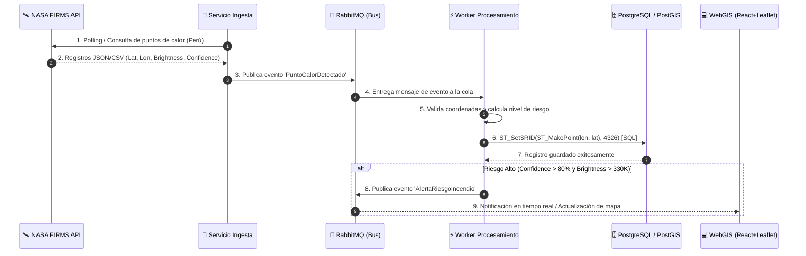

```mermaid
sequenceDiagram
    autonumber
    participant FIRMS as 🛰️ NASA FIRMS API
    participant Ingest as 🐍 Servicio Ingesta
    participant Rabbit as 🐇 RabbitMQ (Bus)
    participant Worker as ⚡ Worker Procesamiento
    participant PostGIS as 🗄️ PostgreSQL / PostGIS
    participant WebGIS as 💻 WebGIS (React+Leaflet)

    Ingest->>FIRMS: 1. Polling / Consulta de puntos de calor (Perú)
    FIRMS-->>Ingest: 2. Registros JSON/CSV (Lat, Lon, Brightness, Confidence)
    Ingest->>Rabbit: 3. Publica evento 'PuntoCalorDetectado'
    Rabbit->>Worker: 4. Entrega mensaje de evento a la cola
    Worker->>Worker: 5. Valida coordenadas y calcula nivel de riesgo
    Worker->>PostGIS: 6. ST_SetSRID(ST_MakePoint(lon, lat), 4326) [SQL]
    PostGIS-->>Worker: 7. Registro guardado exitosamente
    alt Riesgo Alto (Confidence > 80% y Brightness > 330K)
        Worker->>Rabbit: 8. Publica evento 'AlertaRiesgoIncendio'
        Rabbit-->>WebGIS: 9. Notificación en tiempo real / Actualización de mapa
    end
```