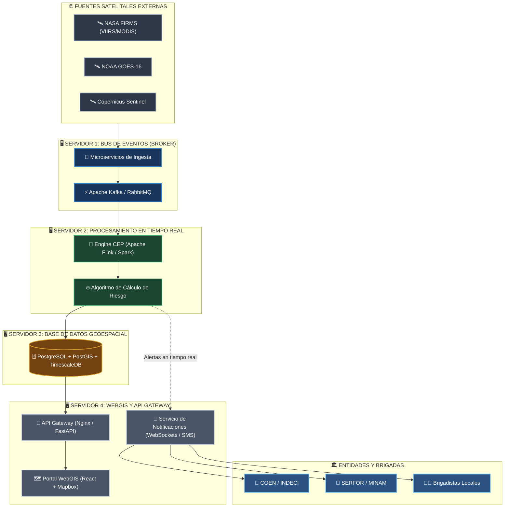

# Arquitectura Técnica Orientada a Eventos (EDA)

## 📐 Topología de Servidores y Diagrama de Arquitectura

---

## 🖥️ Especificación de Servidores e Infraestructura

| Servidor | Rol Principal | Componentes Clave | Hardware Mínimo Recomendado |
| :--- | :--- | :--- | :--- |
| **Servidor 1** | **Bus de Eventos (Broker de Mensajes)** | Apache Kafka / RabbitMQ, Microservicios Python de Ingesta | 8 Núcleos (3.0 GHz+), 16 GB RAM, 500 GB SSD NVMe |
| **Servidor 2** | **Procesamiento en Tiempo Real (CEP)** | Apache Flink / Spark Streaming, Motor de Algoritmos | 8 Núcleos, 16 GB RAM, 256 GB SSD |
| **Servidor 3** | **Base de Datos Geoespacial** | PostgreSQL + PostGIS + TimescaleDB | 8 Núcleos, 32 GB RAM, 1 TB SSD NVMe |
| **Servidor 4** | **WebGIS y API Gateway** | Node.js, FastAPI, Nginx, React + Mapbox, WebSockets | 4 Núcleos (2.5 GHz+), 8 GB RAM, 128 GB SSD |

---

## ⚙️ Definición Operativa de Capas

1. **Capa de Ingesta:** Captura datos continuos en vivo desde NASA FIRMS, Copernicus y GOES-16 mediante llamadas asíncronas y los estandariza a formato GeoJSON[cite: 1].
2. **Capa de Mensajería y Eventos:** Garantiza el desacoplamiento total y la distribución continua de eventos clasificándolos por tópicos regionales (Norte, Centro, Sur, Oriente)[cite: 1].
3. **Capa de Análisis Stream:** Correlaciona anomalías térmicas (temperatura de brillo > 310 K) con datos meteorológicos y mapas de vegetación para calcular niveles de riesgo (Bajo, Medio, Alto, Crítico)[cite: 1].
4. **Capa de Persistencia:** Almacena coberturas geoespaciales y registros históricos en series temporales para análisis de tendencias[cite: 1].
5. **Capa de Presentación y Reacción:** Despliega el tablero WebGIS dinámico y despacha notificaciones automáticas instantáneas a autoridades (COEN/SERFOR) y brigadas de campo[cite: 1].